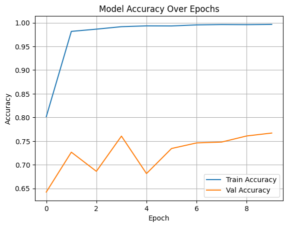
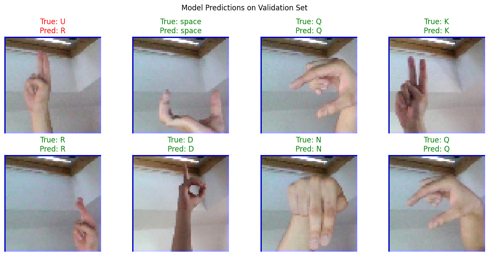

# ASL Alphabet Image Classifier

A Convolutional Neural Network (CNN) trained on the [ASL Alphabet dataset](https://doi.org/10.34740/KAGGLE/DSV/29550) to classify 29 American Sign Language hand gestures (A-Z, plus space, delete, and nothing).

---

## Overview
- **Task:** Multiclass image classification (29 classes).
- **Input:** 64x64 RGB images of ASL gestures.
- **Output:** Predicted ASL letter/sign.
- **Model:** Custom CNN built with Keras/TensorFlow.

---

## Approach
- Resized all images to 64×64 and normalized pixel values.  
- Built CNN with multiple Conv2D -> ReLU -> MaxPooling -> Dropout blocks.  
- Dense(256) layer -> Dropout -> Dense(29, softmax).  
- Trained for 10 epochs on Google Colab (T4 GPU) using Adam optimizer.  
- Evaluated with accuracy, classification report, and confusion matrix.

---

## Results
- **Validation Accuracy:** ~77% after 10 epochs.  
- Strong performance on distinct letters (C, K, L).  
- Struggled with visually similar gestures (M/N, W/X, U/V).  

### Confusion Matrix

---

## Visualizations

### Training Accuracy vs Validation Accuracy

### Sampling Predictions

---

## Lessons Learned 
- A simple CNN can reach ~77% accuracy on ASL gestures without heavy tuning.  
- Distinguishing between visually similar signs remains the key challenge.  
- More advanced architectures or augmentation could improve results.

--- 

## Future Work
- Experiment with transfer learning (e.g., MobileNet, EfficientNet).  
- Apply stronger data augmentation for generalization.  
- Add real-time recognition with OpenCV.  
- Deploy with Streamlit or Flask for interactive use.

---

## Tech Stack
`Python` · `TensorFlow` · `Keras` · `Google Colab` · `Matplotlib` · `Seaborn`

---

## Dataset Citation
Akash Nagaraj. (2018). *ASL Alphabet* [Data set]. Kaggle. [https://doi.org/10.34740/KAGGLE/DSV/29550](https://doi.org/10.34740/KAGGLE/DSV/29550)  
