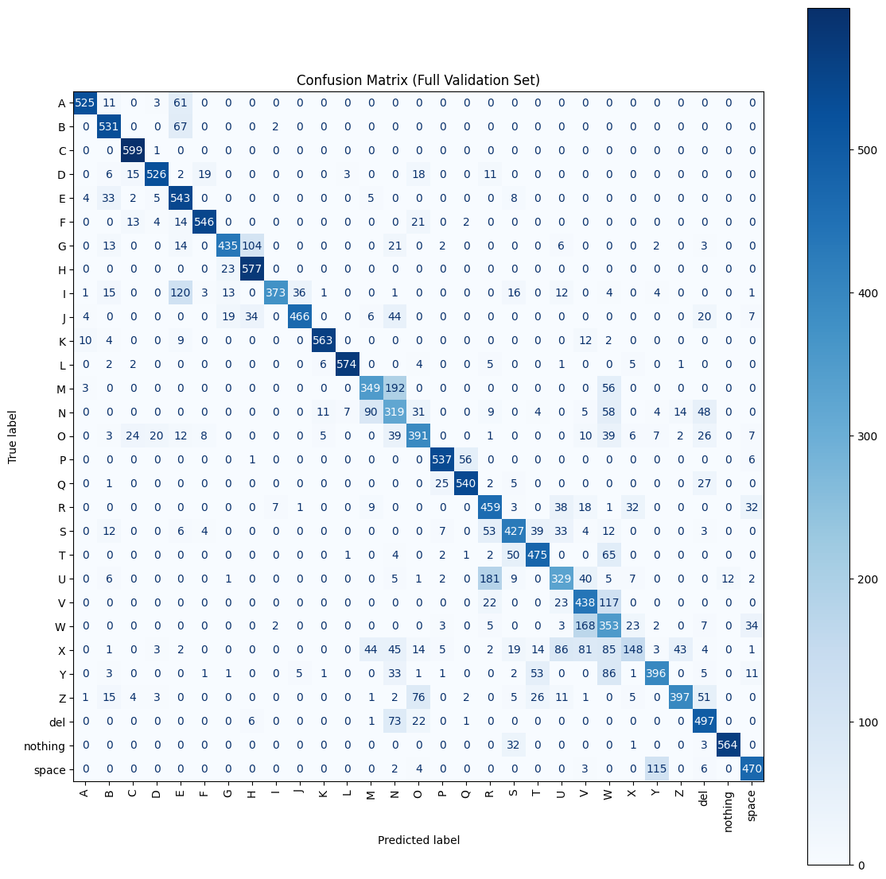

# ASL Alphabet Image Classifier

---

## One Sentence Summary

This repository trains a CNN on the [ASL Alphabet](https://www.kaggle.com/datasets/grassknoted/asl-alphabet?select=asl_alphabet_train) from Kaggle to classify 29 differnt American Sign Language hand gestures.

---

## Overview

### Task Definition

This project tackles a multi-class image classification task. The objective is to predict which letter (A-Z) or sign (space, del, nothing) an image represents based on static images of hand gestures.

### Approach

The dataset is processed using TensorFlow's `ImageDataGenerator`. All images are resized to 64x64 and normalized. A Convolutional Neural Network (CNN) is built from scratch using Keras with multiple convolutional blocks, ReLu activations, MaxPooling, and Dropout layers. The model is trained for 10 epochs on a Colab Pro (T4 GPU) environment.

### Performance Summary

The model achieves approximately **76.7% validation accuracy** after 10 epochs. It performs well on letters with distinct shapes (C, L, K), but has difficulty with visually similar gestures (e.g., M/N, W/X).

---

## Summary of Work Done

- Loaded and cleaned the ASL dataset
- Built and trained a CNN from scratch
- Evaluated using accuracy and classification report
- Generated confusion matrix and training visualizations
- Exporte model as `.h5` file

---

## Data 

### Dataset

**Name**: ASL Alphabet

**Author**: Akash Nagaraj

**Source**: [Kaggele](https://www.kaggle.com/datasets/grassknoted/asl-alphabet?select=asl_alphabet_train)

**Type**: PNG images (200x200) categorized into folders

**Classes**: 29 -- letters A-Z, plus "space", "del", "nothing"

**Size**: ~87,000 total images

**Download Format**: `.zip` files (train & test)

### Instances (Train/Validation Split)

- Used `ImageDataGenerator` with `validation_split=0.2`
- Training data: 80%
- Validation data: 20%

### Preprocessing / Cleanup

- Resized all images to 64x64
- Normalized pixel values to [0, 1]
- Labels extracted from directory

### Data Visualization

- Class distibution bar chart
- Training/validation accuracy and loss curves
- Confusion matrix

---

## Problem Formulation 

- **Input**: RGB image (64x64)
- **Output**: Predictied label (1 of 29 ASL categories)
- **Task**: Multiclass image classification

---

## Models

### Architecture

Custom CNN with: 
- 2x Conv2D -> ReLu -> MaxPooling -> Dropout
- Flatten -> Dense(256) -> Dropout -> Dense(29, softmax)

### Loss / Optimizer / Hyperparameters

- Loss: SparseCategoricalCrossentropy
- Optimizer: Adam
- Epochs: 10
- Batch Size: 64

---

## Training 

### Environment

- Platform: Google Colab Pro
- GPU: T4
- Time: ~7-10 minutes for 10 epochs
- Framwork: TensorFlow/Keras

### Training Curves

### Early Stopping 

Training stopped manually after 10 epochs

### Challenges

- Dataset was large; required upload and manual extraction
- Similar letter signs (e.g., M vs. N, U vs. V)

---

## Performance Comparison

| Metric     | Value     |
|------------|-----------|
| Accuracy   | 76.7%     |
| Classes    | 29        |
| Epochs     | 10        |

### Sample Evaluation

---

## Conclusions

- Model performed well on distinct gestures like C, K, and L
- Performance dipped on visually similar gestures
- Basic CNN architecture can reach ~77% with limited tuning

---

## Future Work

- Integrate real-time sign recognition with OpenCV
- Experiment with transfer learning (e.g., MobileNet, EfficientNet)
- Add deployment using Streamlit or Flask
- Apply dataq augmentation more aggressively to improve generalization

---

## Citations

Akash Nagaraj. (2018). ASL Alphabet [Data set]. Kaggle. https://doi.org/10.34740/KAGGLE/DSV/29550
